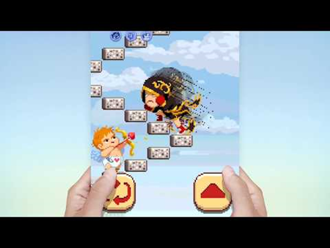
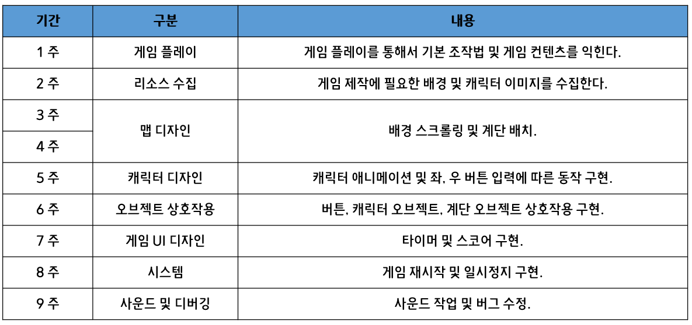

# SMG Term Project

## 2014180044 허 신 영

1. ## 게임 소개 [ 무한의 계단 ]

   방향 전환 버튼과 계단을 올라가는 버튼을 통해 계단을 올라가는 게임이다.

   게임이 시작하면 타이머가 감소하고, 제한 시간안에 많은 계단을 올라가는 것이 목표이다.

   

   

   

   

   2. ## 현재까지의 진행 상황

      

      - 리소스 수집:: 메뉴 및 시스템 리소스 / 게임 스코어 리소스를 아직 구하지 못했다.
   - 맵 디자인 :: 배경 스크롤링 완료. 계단 배치 30% 완료. 상호작용 테스트를 위해 임시적인 계단 배치만 되어있는 상태.
      - 캐릭터 디자인 :: 캐릭터 애니메이션 및 좌, 우 버튼 입력에 따른 동작구현 완료.
      - 오브젝트 상호작용 :: 방향전환 버튼 완료. 계단 오르기 버튼 완료. 플레이어와 계단의 상호작용 완료.
   
   

   

   3. MainGame에 등장하는 GameObject

      - Brick :: 위치 정보(x, y)와 방향 정보(current dir)를 가지고 있다.

      - Player :: 위치정보 (x, y), 방향 정보(current dir), 현재 계단 인덱스 (currentStair) 정보를 가지고 있다.

      - 상호작용 :: 계단 오르기 버튼을 누르면 Player의 upStairs() 함수를 호출한다.

        ​				upStairs() 함수에서는 MainGame에서 Brick의 ArrayList 정보를 받아온다.

        ​				현재 계단의 방향과 플레이어의 방향이 같다면 다음 계단으로 인덱스를 갱신하고 

        ​				플레이어와 계단의 위치값을 조정한다.

        

        

4. ## git commit

   