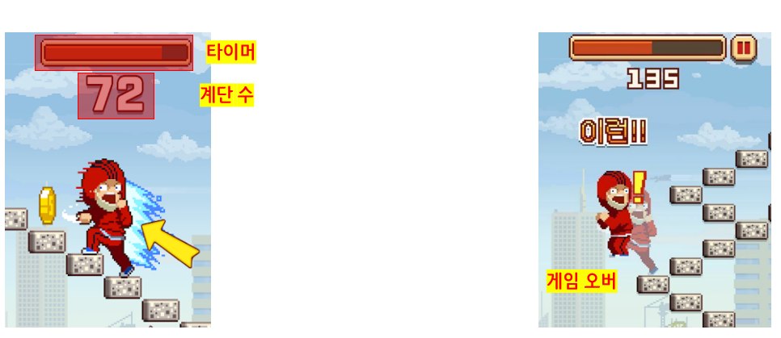
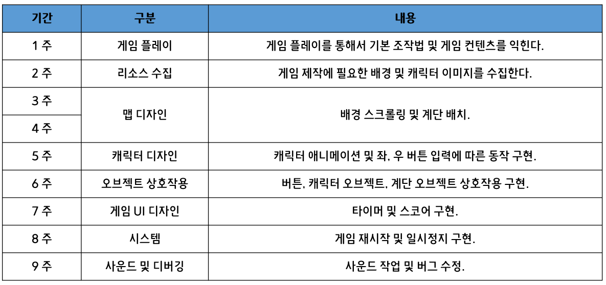

# SMG Term Project

## 2014180044 허 신 영

## 1. 게임 컨셉 [ 무한의 계단 ]

- 무한의 계단은 버튼을 눌러 계단을 올라가는 간단한 아케이드 게임이다.
- 좌, 우 버튼만을 통해서 게임을 진행할 수 있다.
- 타이머가 존재하며, 타이머가 끝나면 게임이 종료된다.
- 계단 오르기에 성공하면 약간의 타이머 시간이 증가한다.

## 2. 개발 범위

- **캐릭터**	: 스프라이트 애니메이션 및 좌, 우 방향 전환
- **스테이지** : 배경 이미지 스크롤링을 통한 움직임.
- **난이도** : 타이머의 감소 시간을 통한 난이도 조절.
-  **게임 기능** : 계단 오르기 성공 시 타이머 소량 증가. 타이머 모두 소진 시 게임 오버.

## 3. 예상 게임 실행 흐름

1. 좌, 우 버튼을 배치하여 클릭한 방향으로 계단을 오를 수 있다.

2. 타이머 하단에 오른 계단의 수를 출력한다.

3. 타이머를 모두 소진하거나 계단을 잘못 오를 경우 게임을 종료한다.

   

## 4. 개발 일정

